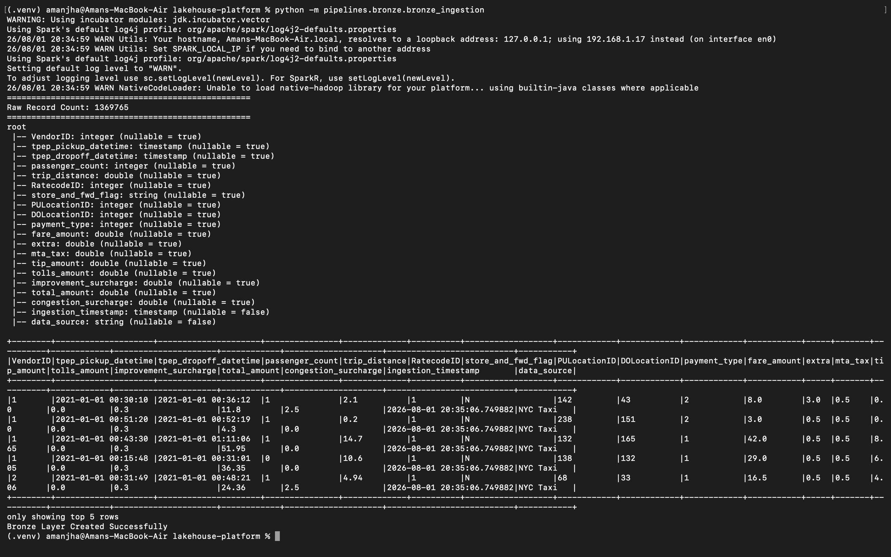
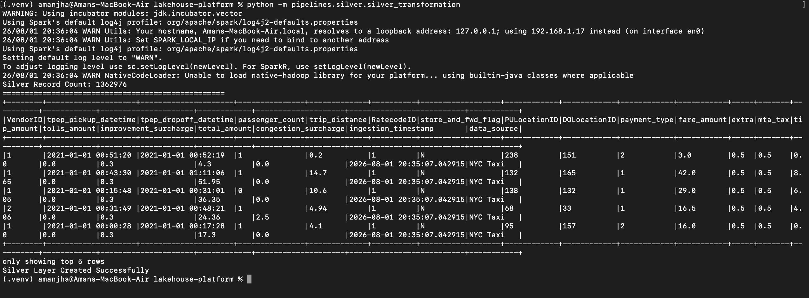
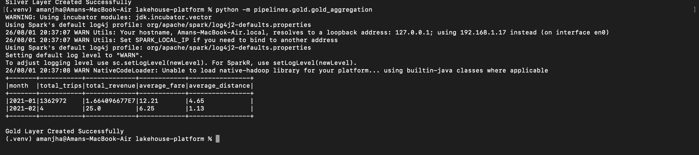

# 🚀 Lakehouse Platform using Medallion Architecture

A production-style Data Engineering project built using PySpark following the Medallion Architecture (Bronze → Silver → Gold).

## Tech Stack

- Python
- PySpark
- Delta Lake
- SQL
- ETL
- Medallion Architecture
- Data Validation
- Git

---

## Features

✔ Bronze Layer Ingestion

✔ Silver Layer Cleansing

✔ Gold Layer Business Aggregations

✔ Incremental ETL

✔ Logging

✔ Error Handling

✔ Data Quality Checks

✔ Modular Pipeline

✔ Configuration Driven

✔ Production Folder Structure

# 🚀 Lakehouse Platform using Medallion Architecture

A production-style Data Engineering project built using **PySpark** that demonstrates the complete ETL lifecycle using the **Medallion Architecture (Bronze → Silver → Gold)**.

This project ingests raw NYC Taxi trip data, performs data quality validation and transformation, and generates business-ready analytics.

---

# 📌 Project Overview

The objective of this project is to simulate a production ETL pipeline that processes raw data into curated analytical datasets.

The pipeline follows three logical layers:

- Bronze Layer – Raw Data Ingestion
- Silver Layer – Data Cleaning & Validation
- Gold Layer – Business Aggregations

---

# 🏗 Architecture

```
                   Raw CSV Dataset
                          │
                          ▼
                 Bronze Layer (Raw)
          - Read CSV using PySpark
          - Infer Schema
          - Add Audit Columns
          - Store as Parquet
                          │
                          ▼
               Silver Layer (Cleaned)
          - Remove Duplicates
          - Handle Null Values
          - Business Validations
          - Filter Invalid Records
                          │
                          ▼
               Gold Layer (Analytics)
          - Monthly Trip Count
          - Total Revenue
          - Average Fare
          - Average Distance
```

---

# 🛠 Tech Stack

- Python 3.13
- Apache Spark (PySpark)
- Parquet
- Git
- VS Code

---

## Bronze Layer



## Silver Layer



## Gold Layer



# 📂 Project Structure

```
lakehouse-platform
│
├── config/
│
├── data/
│   ├── raw/
│   ├── bronze/
│   ├── silver/
│   └── gold/
│
├── pipelines/
│   ├── bronze/
│   │   └── bronze_ingestion.py
│   │
│   ├── silver/
│   │   └── silver_transformation.py
│   │
│   └── gold/
│       └── gold_aggregation.py
│
├── utils/
│   └── spark_session.py
│
├── main.py
│
└── README.md
```

---

# ⚙ Pipeline Workflow

## Bronze Layer

Responsibilities:

- Read raw CSV dataset
- Infer schema automatically
- Add audit columns
- Store raw data as Parquet

Audit Columns Added

- ingestion_timestamp
- data_source

---

## Silver Layer

Responsibilities

- Remove duplicate records
- Remove invalid fares
- Remove invalid trip distances
- Remove null pickup timestamps
- Filter invalid business records

---

## Gold Layer

Business KPIs Generated

- Monthly Trip Count
- Total Revenue
- Average Fare
- Average Trip Distance

---

# 📊 Sample Output

| Month | Total Trips | Revenue | Avg Fare | Avg Distance |
|--------|------------:|---------:|----------:|-------------:|
| 2021-01 | 1,362,972 | 16.64 M | 12.21 | 4.65 |
| 2021-02 | 4 | 25.00 | 6.25 | 1.13 |

---

# 🚀 How to Run

Clone the repository

```bash
git clone <repository-url>
cd lakehouse-platform
```

Create Virtual Environment

```bash
python3 -m venv .venv
source .venv/bin/activate
```

Install Dependencies

```bash
pip install -r requirements.txt
```

Run Bronze Layer

```bash
python -m pipelines.bronze.bronze_ingestion
```

Run Silver Layer

```bash
python -m pipelines.silver.silver_transformation
```

Run Gold Layer

```bash
python -m pipelines.gold.gold_aggregation
```

---

# 📈 Results

Successfully processed **1.36 million+ NYC Taxi records** through a multi-stage ETL pipeline.

Implemented:

- Medallion Architecture
- Data Quality Validation
- Modular ETL Design
- Business Aggregations
- Reusable Spark Session
- Production-style Project Structure

---

# 🔮 Future Improvements

- Delta Lake
- Airflow Orchestration
- Docker
- GitHub Actions CI/CD
- Unit Testing
- Power BI Dashboard
- AWS S3 Integration
- Databricks Deployment

---

# 👨‍💻 Author

**Aman Jha**

Data Engineering | PySpark | SQL | ETL | Data Warehousing
